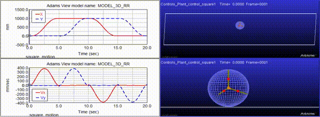

# Dynamic Modelling of a 3D rolling robot

This repo consists of the code (mainly in Mathematica and Matlab) written for the dynamic modelling of a rolling robot, which is actuated by a reciprocating mass.

The following configurations of the robot are studied:
-  reciprocating masses without any compliant element
-  reciprocating masses with fixed stiffness springs
-  reciprocating masses with variable stiffness springs

The dynamics equations, generated in Mathematica, were validated using ADAMS. Furthermore, we used MATLAB/Simulink to perform the trajectory tracking control of the robot.

Please go through the [project report](rolling_robot_report.pdf) for more details.

# Results

[Video link](https://www.youtube.com/watch?v=aDLdKx2OYiM)
